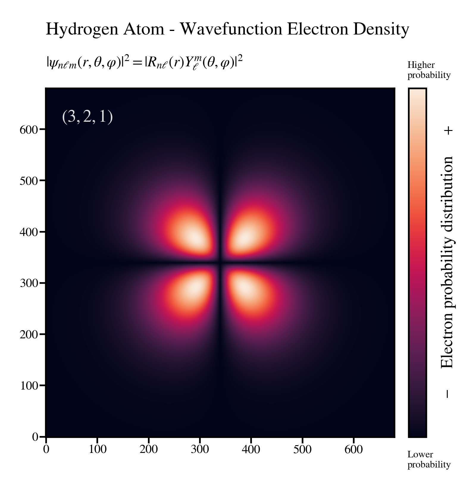
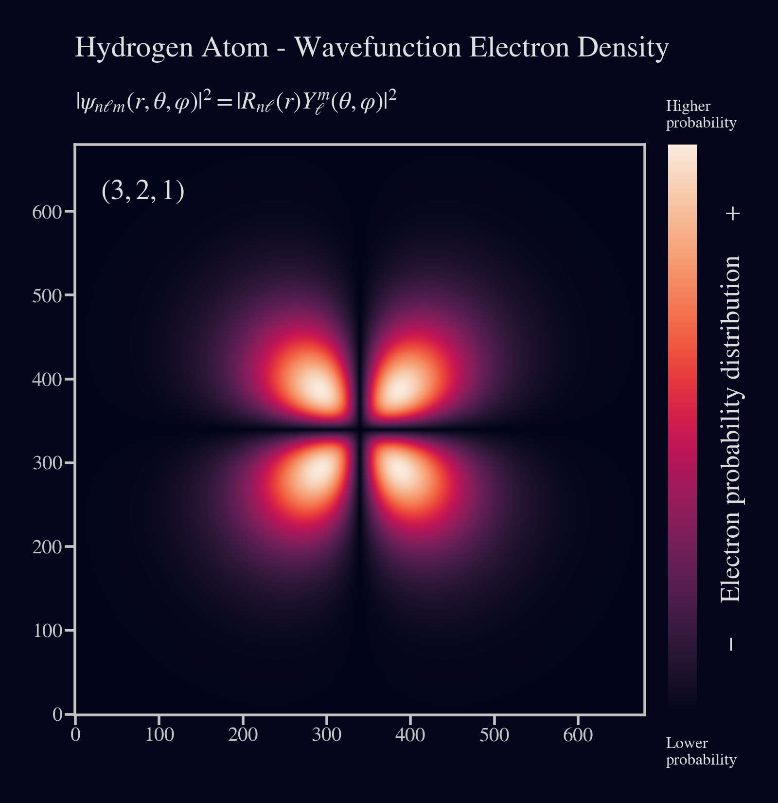
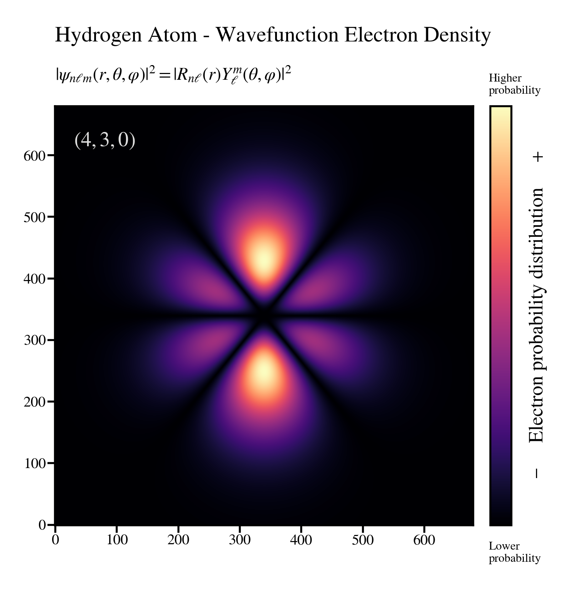
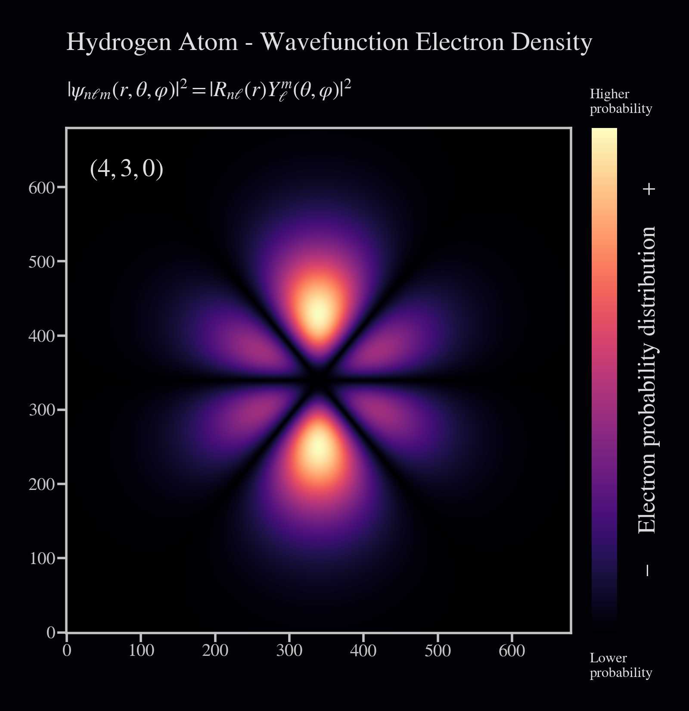
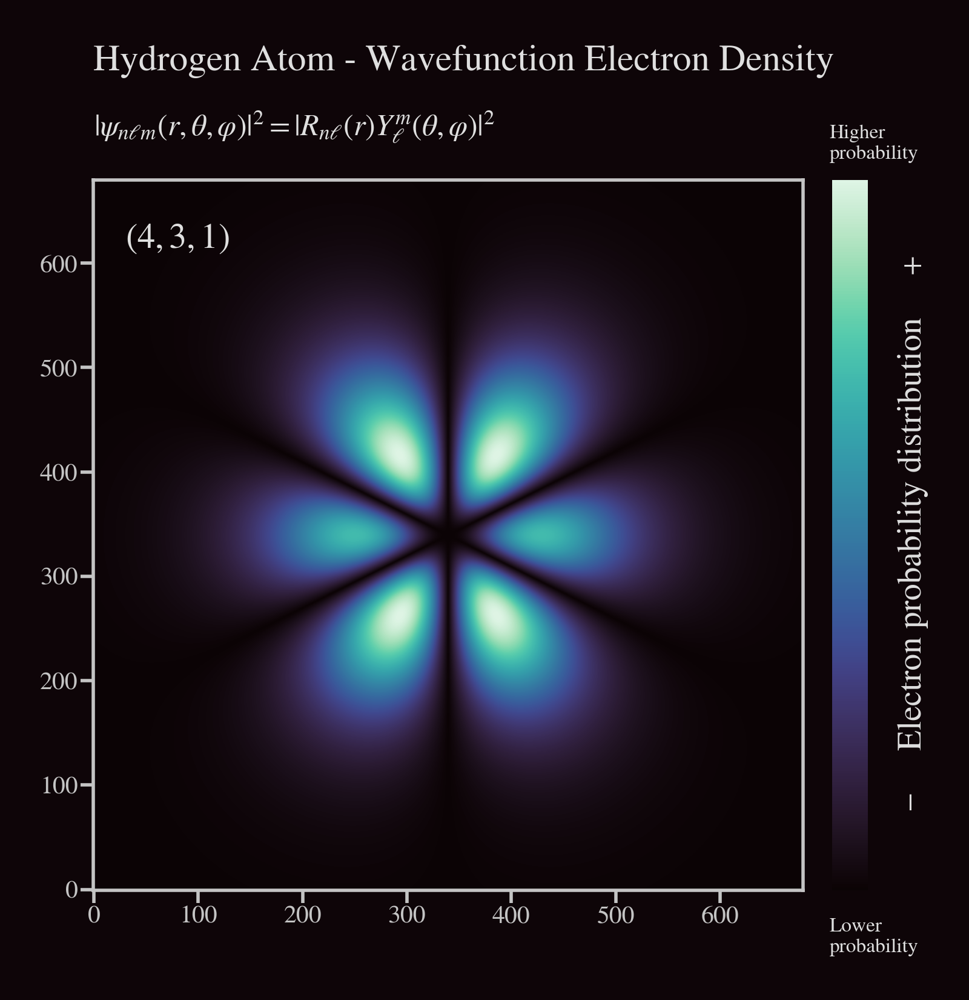
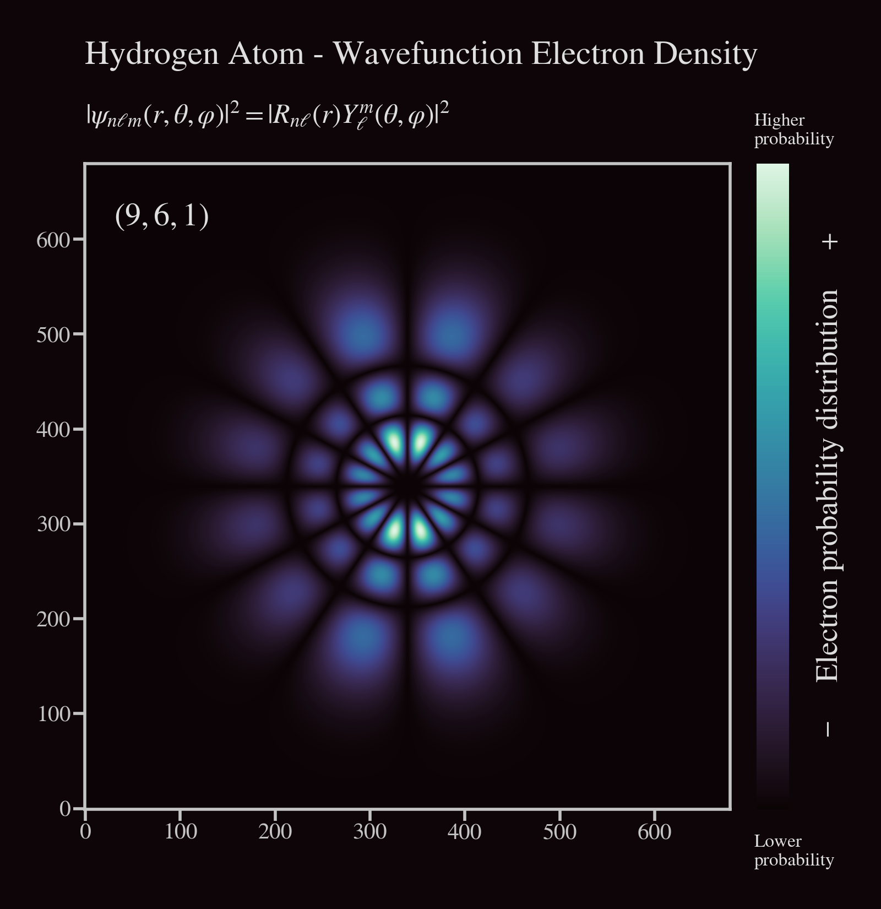
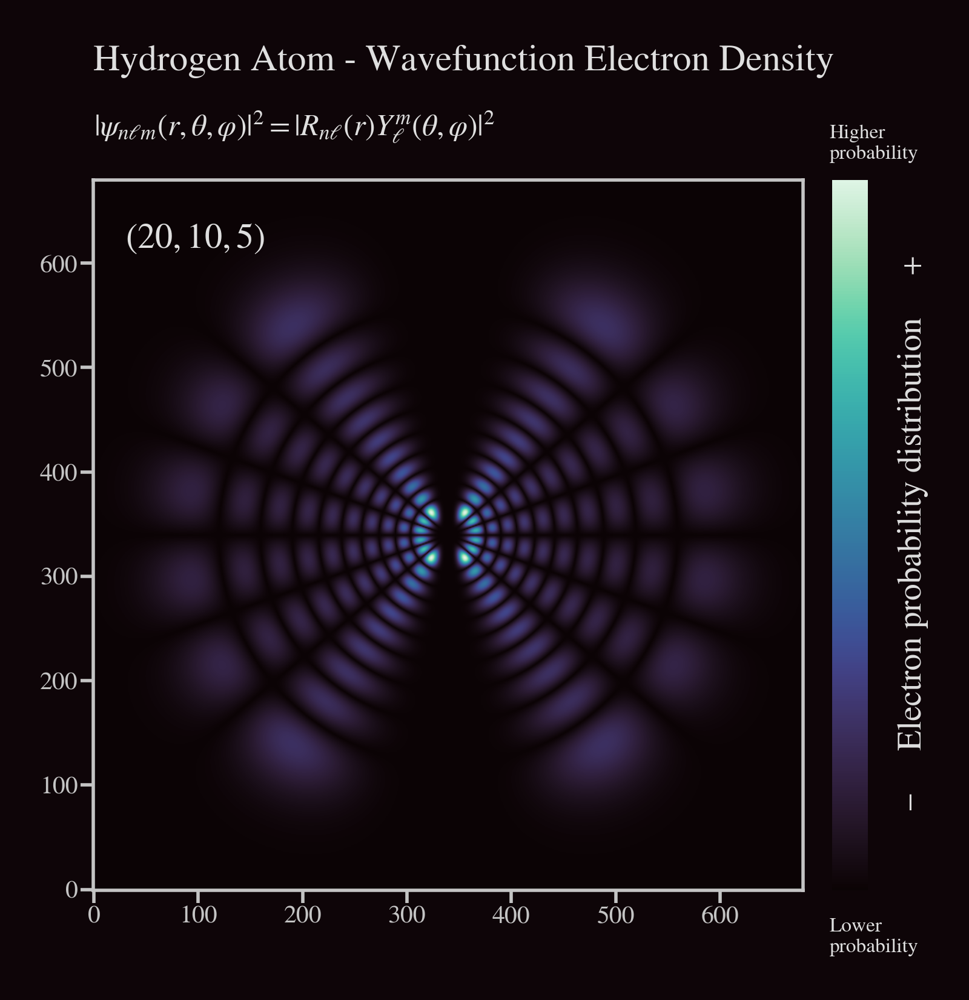

# Hydrogen Wavefunctions & Electron Density

Modeling and visualization of hydrogen atom wavefunctions and 
electron probability density.

* Python 3.11.4
* Matplotlib 3.7.2
* Seaborn 0.12.2
* NumPy 1.25.2
* SciPy 1.11.1

---
### Main Project Files | Execution Methods
* [Standalone Module](hydrogen_wavefunction.py)
* [Standalone Module with extended comments](hydrogen_wavefunction_annotated.py)
* [Executable with CLI & Command Line Arguments](hydrogen_wavefunction_cli.py)
* [IPython Notebook / Jupyter Notebook](hydrogen_wavefunction_notebook.ipynb)
---

## Content
#### Theoretical Background
* [Quantum Mechanics and Atomic Systems: A Brief Overview](#1-quantum-mechanics-and-atomic-systems-a-brief-overview)
* [Wavefunctions](#11-wavefunctions)
* [Electron Density | Probability Density](#12-electron-density--probability-density)
* [Atomic Orbitals](#13-atomic-orbitals)
* [Quantum Numbers](#14-quantum-numbers)
* [Schrödinger Equation for Hydrogen Atom Wavefunction](#2-schrödinger-equation-for-hydrogen-atom-wavefunction)
  
#### Practical Implementation
* [Usage and Demos](#usage-and-demos)

---

### 1. Quantum Mechanics and Atomic Systems: A Brief Overview

Quantum mechanics (QM) is the fundamental theory in physics that provides a 
description of the physical properties of nature at the scale of atoms and subatomic particles. 
Unlike classical mechanics which describes macroscopic phenomena, QM addresses the behavior 
of matter and energy on the quantum (smallest discrete) level.

The hydrogen atom is especially significant as it is the simplest atom, containing just one electron. 
Its wavefunction can be treated analytically, providing profound insights into the nature of quantum systems. 
Solutions for the hydrogen atom pave the way for understanding more complex atomic and molecular structures.

---

#### 1.1 Wavefunctions

Central to the theory of quantum mechanics is the concept of the wavefunction ($\psi$), 
which provides a complete description of a quantum system's state. 

It's a mathematical function that associates a probability amplitude to every point in the configuration space of the system, 
serving as a mathematical representation of a particle’s state and it 
probabilistic behavior in space and time.

---

#### 1.2 Electron Density | Probability Density

The probability density ($|\psi|^2$), also known as the electron density, 
describes the likelihood of finding a particle at a given position in space. 
It is the square of the magnitude of the wavefunction. 

For an electron in an atom, it describes the spatial distribution 
of the probability of locating the electron.

<p align='center'>
    
</p>
<p align='center'>
    <i>Electron density plot showing regions of varying electron probability</i>
</p>

---

#### 1.3 Atomic Orbitals

Atomic orbitals are mathematical functions that describe the wave-like 
behavior of either one electron or a pair of electrons in an atom. These 
functions can be used to determine the probability of finding an 
electron in any specific region around the atom's nucleus.

---

#### 1.4 Quantum Numbers

Quantum numbers are a set of numerical values that provide a complete 
description of a quantum particle's state. 
For electrons in an atom, there are typically four quantum numbers:
<br><br>

- Principal quantum number ($n$): `( 1 <= n )`<br>
Represents the electron's energy level and relative size of the orbital.


- Azimuthal quantum number ($l$): `( 0 <= l <= n-1 )`<br>
Relates to the shape of the atomic orbital.


- Magnetic quantum number ($m_l$): `( -l <= m <= l )`<br>
Specifies the orientation of the orbital in space.


- Spin quantum number ($m_s$): `( +1/2 or -1/2 )`<br>
Describes the electron's intrinsic spin.


In the hydrogen atom, or any atom with a single electron (like ionized helium, lithium, etc.), 
the electron's spin doesn't interact with anything else to affect its spatial distribution. 

This is because there's only one electron, and thus no possibility of electron-electron spin 
interactions which become relevant in multi-electron systems.

> [!NOTE]
> For our specific application with the hydrogen atom, we will focus on the first three quantum numbers. 
> As the electron's spin doesn't influence the shape or 
distribution of the electron cloud.

---

### 2. Schrödinger Equation for Hydrogen Atom Wavefunction

The Schrödinger equation serves as the foundation of quantum mechanics,
it is a differential equation that determines the wavefunctions of a quantum system. 
For the hydrogen atom, it can be represented as:

### $\hat{H} \psi = E \psi$

Solving this equation yields the wavefunctions which are usually 
expressed in terms of radial and angular parts.

> [!NOTE]  
> Given the spherical symmetry of the hydrogen atom, we choose spherical 
coordinates. 
> 
>This choice facilitates the separation of variables, allowing 
us to decouple the radial and angular 
components of the problem.

---

#### 2.1 Radial Component

### $R_{n \ell}(r) = \sqrt{\left( \frac{2}{n a_0} \right)^3 \frac{(n-\ell-1)!}{2n(n+\ell)!}} e^{-\frac{r}{n a_0}} \left( \frac{2r}{n a_0} \right)^{\ell} L_{n-\ell-1}^{2\ell+1}\left(\frac{2r}{n a_0}\right)$

The radial wavefunction gives us information about the probability
distribution of the electron as a function of distance $r$ from the 
nucleus. Its form encompasses three major terms:

- **Exponential Decay**: Signifies the probability decay of finding an 
electron as we move away from the nucleus. Here, $a_0$ is the Bohr 
radius which sets a characteristic scale for atomic dimensions.

### $e^{-\frac{r}{n a_0}}$ 

<br>

- **Power term**: Dictates how the probability changes with $r$. 
The azimuthal quantum number $\ell$ plays a significant role in determining 
the number of nodes in the radial distribution.

### $\left( \frac{2r}{n a_0} \right)^{\ell}$ 

<br>

- **Associated Laguerre Polynomials**: These polynomials contribute to the finer structure of the radial part, 
especially defining nodes (regions where the probability is zero).

### $L_{n-\ell-1}^{2\ell+1}\left(\frac{2r}{n a_0}\right)$

---

#### 2.2 Angular Component

### $Y_{\ell}^{m}(\theta, \varphi) = (-1)^m \sqrt{\frac{(2\ell+1)}{4\pi}\frac{(\ell-m)!}{(\ell+m)!}} P_{\ell}^{m}(\cos\theta) e^{im\varphi}$

Yields the spherical harmonics, which gives the angular dependence of the wavefunction in 
terms of the polar ($\theta$) and azimuthal ($\phi$) angles.

These spherical harmonics provide a detailed account of the shapes and orientations of atomic orbitals,
characterizing how electron probability distributions are spread out in space. 
It has two components:

- **Associated Legendre Polynomials**: These dictate the shape of the orbital in the polar ($\theta$) direction,
helping to define the characteristic shapes (s, p, d, etc.) we often associate with atomic orbitals.

### $P_{\ell}^{m}(\cos\theta)$

<br>

- **Exponential Azimuthal Term**: This term provides the orientation of the orbital in the azimuthal plane, as 
determined by the magnetic quantum number $m$.

### $e^{im\varphi}$

---

#### 2.3 Normalized wavefunction

Combining the solutions of the radial and angular parts, we obtain 
the normalized wavefunction for the hydrogen atom:

### $\psi_{nlm_l}(r, \theta, \varphi) = R_{n,l}(r) Y_{l}^{m_l}(\theta, \varphi)$

Normalization of the wavefunction is essential in quantum mechanics. 
This ensures that when we integrate $|\psi_{n \ell m}|^2$ over all space, the result is 1, 
indicating a certainty of finding the electron somewhere in space.
<br>

To determine the probability density of the electron being in a certain location,
we take the magnitude squared of the wavefunction: $|\psi_{n \ell m}|^2$

### $P(r, \theta, \varphi) = |\psi_{n,l,m_l}(r, \theta, \varphi)|^2$

By analyzing this probability density, we gain a thorough understanding 
of atomic orbitals' shapes and sizes as these visual representations bridge 
the gap between the abstract realm of quantum mechanics and our intuitive 
understanding of phenomena dictating macroscopic events.

---

## Implementation

### Usage and demos

* [Standalone Module:](hydrogen_wavefunction.py)
Run in your preferred IDE or code editor.
* [Standalone Module with extended comments:](hydrogen_wavefunction_annotated.py)
Run in your preferred IDE or code editor.
* [Executable with CLI & Command Line Arguments:](hydrogen_wavefunction_cli.py)
Run directly for the CLI tool or with command line arguments.
* [IPython Notebook / Jupyter Notebook:](hydrogen_wavefunction_notebook.ipynb)
Open with Jupyter Notebook.

---

#### Command line arguments:

```
$ python hydrogen_wavefunction_cli.py --help
```

```   
usage: hydrogen_wavefunction_cli.py [-h] [--dark_theme] [--color_palette COLOR_PALETTE] [n] [l] [m] [a0_scale_factor]

Hydrogen Atom - Wavefunction and Electron Density Visualization 
for specific quantum states (n, l, m).  

positional arguments:
  n                     (n) Principal quantum number (int)
  l                     (l) Azimuthal quantum number (int)
  m                     (m) Magnetic quantum number (int)
  a0_scale_factor       Bohr radius scale factor (float)

options:
  -h, --help            show this help message and exit
  --dark_theme          If set, the plot uses a dark theme
  --color_palette       Seaborn plot color palette

```

---

#### Input args:
    $ python hydrogen_wavefunction_cli.py 3 2 1 0.3

|                 |          Argument          | Value |  Constraint   |
|:---------------:|:--------------------------:|:-----:|:-------------:|
|        n        |  Principal quantum number  |   3   |    1 <= n     |
|        l        |  Azimuthal quantum number  |   2   | 0 <= l <= n-1 |
|        m        |  Magnetic quantum number   |   1   | -l <= m <= l  |
| a0_scale_factor |  Bohr radius scale factor  |  0.3  |               |
|   dark_theme    |   Enable plot dark theme   |       |               |
|  color_palette  | Seaborn plot color palette |       |               |

#### Output:

<p align='left'>
  
</p>

---

#### Input args:
    $ python hydrogen_wavefunction_cli.py 3 2 1 0.3 --dark_theme

|                 |          Argument          |    Value     |  Constraint   |
|:---------------:|:--------------------------:|:------------:|:-------------:|
|        n        |  Principal quantum number  |      3       |    1 <= n     |
|        l        |  Azimuthal quantum number  |      2       | 0 <= l <= n-1 |
|        m        |  Magnetic quantum number   |      1       | -l <= m <= l  |
| a0_scale_factor |  Bohr radius scale factor  |     0.3      |               |
|   dark_theme    |   Enable plot dark theme   | --dark_theme |               |
|  color_palette  | Seaborn plot color palette |              |               |

#### Output:

<p align='left'>
  
</p>

---

#### Input args:
    $ python hydrogen_wavefunction_cli.py 4 3 0 0.2 --color_palette "magma"

|                 |          Argument          |  Value  |  Constraint   |
|:---------------:|:--------------------------:|:-------:|:-------------:|
|        n        |  Principal quantum number  |    4    |    1 <= n     |
|        l        |  Azimuthal quantum number  |    3    | 0 <= l <= n-1 |
|        m        |  Magnetic quantum number   |    0    | -l <= m <= l  |
| a0_scale_factor |  Bohr radius scale factor  |   0.2   |               |
|   dark_theme    |   Enable plot dark theme   |         |               |
|  color_palette  | Seaborn plot color palette | "magma" |               |

#### Output:

<p align='left'>
  
</p>

---

#### Input args:
    $ python hydrogen_wavefunction_cli.py 4 3 0 0.2 --dark_theme --color_palette "magma"

|                 |          Argument          |    Value     |  Constraint   |
|:---------------:|:--------------------------:|:------------:|:-------------:|
|        n        |  Principal quantum number  |      4       |    1 <= n     |
|        l        |  Azimuthal quantum number  |      3       | 0 <= l <= n-1 |
|        m        |  Magnetic quantum number   |      0       | -l <= m <= l  |
| a0_scale_factor |  Bohr radius scale factor  |     0.2      |               |
|   dark_theme    |   Enable plot dark theme   | --dark_theme |               |
|  color_palette  | Seaborn plot color palette |   "magma"    |               |

#### Output:

<p align='left'>
  
</p>

---

#### Input args:
    $ python hydrogen_wavefunction_cli.py 4 3 1 0.2 --dark_theme --color_palette "mako"

|                 |          Argument          |    Value     |  Constraint   |
|:---------------:|:--------------------------:|:------------:|:-------------:|
|        n        |  Principal quantum number  |      4       |    1 <= n     |
|        l        |  Azimuthal quantum number  |      3       | 0 <= l <= n-1 |
|        m        |  Magnetic quantum number   |      1       | -l <= m <= l  |
| a0_scale_factor |  Bohr radius scale factor  |     0.2      |               |
|   dark_theme    |   Enable plot dark theme   | --dark_theme |               |
|  color_palette  | Seaborn plot color palette |    "mako"    |               |

#### Output:

<p align='left'>
  
</p>

---

#### Input args:
    $ python hydrogen_wavefunction_cli.py 9 6 1 0.04 --dark_theme --color_palette "mako"

|                 |          Argument          |    Value     |  Constraint   |
|:---------------:|:--------------------------:|:------------:|:-------------:|
|        n        |  Principal quantum number  |      9       |    1 <= n     |
|        l        |  Azimuthal quantum number  |      6       | 0 <= l <= n-1 |
|        m        |  Magnetic quantum number   |      1       | -l <= m <= l  |
| a0_scale_factor |  Bohr radius scale factor  |     0.04     |               |
|   dark_theme    |   Enable plot dark theme   | --dark_theme |               |
|  color_palette  | Seaborn plot color palette |    "mako"    |               |

#### Output:

<p align='left'>
  
</p>

---

#### Input args:
    $ python hydrogen_wavefunction_cli.py 20 10 5 0.01 --dark_theme --color_palette "mako"

|                 |          Argument          |    Value     |  Constraint   |
|:---------------:|:--------------------------:|:------------:|:-------------:|
|        n        |  Principal quantum number  |      20      |    1 <= n     |
|        l        |  Azimuthal quantum number  |      10      | 0 <= l <= n-1 |
|        m        |  Magnetic quantum number   |      5       | -l <= m <= l  |
| a0_scale_factor |  Bohr radius scale factor  |     0.01     |               |
|   dark_theme    |   Enable plot dark theme   | --dark_theme |               |
|  color_palette  | Seaborn plot color palette |    "mako"    |               |

#### Output:

<p align='left'>
  
</p>

---
