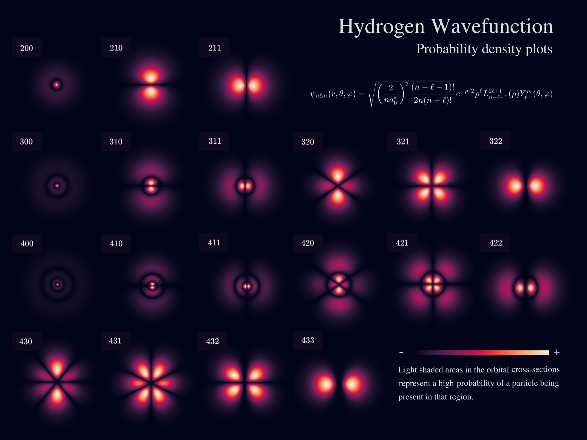
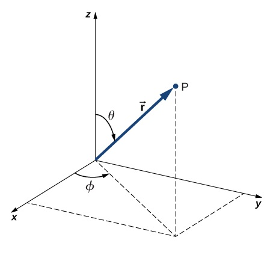

# Hydrogen Wavefunctions & Electron Density Plots

Modeling and visualization of hydrogen atom wavefunctions and 
electron probability density.

* Python 3.11.4
* Matplotlib 3.7.2
* Seaborn 0.12.2
* NumPy 1.25.2
* SciPy 1.11.1

---
### Main Project Files | Execution Methods
* [Standalone Module](hydrogen_wavefunction.py)
* [Standalone Module with extended comments](hydrogen_wavefunction_annotated.py)
* [Executable with CLI & Command Line Arguments](hydrogen_wavefunction_cli.py)
* [IPython Notebook / Jupyter Notebook](hydrogen_wavefunction_notebook.ipynb)
---

## Content
#### Theoretical Background
* [Quantum Mechanics and Atomic Systems: A Brief Overview](#1-quantum-mechanics-and-atomic-systems-a-brief-overview)
* [Schrödinger Equation for Hydrogen Atom Wavefunctions](#2-schrödinger-equation-for-hydrogen-atom-wavefunctions)
  
#### Practical Implementation
* [Execution](#execution)

---

### 1. Quantum Mechanics and Atomic Systems: A Brief Overview

Quantum mechanics (QM) is the fundamental theory in physics that provides a 
description of the physical properties of nature at the scale of atoms and subatomic particles. 
Unlike classical mechanics which describes macroscopic phenomena, QM addresses the behavior 
of matter and energy on the quantum (smallest discrete) level.

The hydrogen atom is especially significant as it is the simplest atom, containing just one electron. 
Its wavefunction can be treated analytically, providing profound insights into the nature of quantum systems.

<br>

<p align='center'>
  
</p>
<p align='center'>
    <i>Electron probability density for hydrogen atom orbitals shown as cross-sections</i>
</p>

---

#### 1.1 Wavefunctions

A wavefunction, often denoted as ($\psi$), represents the quantum state of a particle in a system. 
It provides information about the probability amplitude of position and momentum states of the particle. 


#### 1.2 Electron Density | Probability Density

The square magnitude of the wavefunction $|\psi|^2$, gives the probability density for 
the particle's position in space. For an electron in an atom, it describes the spatial distribution 
of the probability of locating the electron.


#### 1.3 Atomic Orbitals

These are mathematical functions that describe the wave-like 
behavior of either one electron or a pair of electrons in an atom. These 
functions can be used to determine the probability of finding an 
electron in any specific region around the atom's nucleus.

<br>

<p align='center'>
    
</p>
<p align='center'>
    <i>Electron density plot showing regions of varying electron probability</i>
</p>

---

#### 1.4 Quantum Numbers

We can describe quantum numbers as a set of numerical values that provide a complete 
description of a quantum particle's state. 
For electrons in an atom, there are typically four quantum numbers:
<br>

- Principal quantum number ($n$): `( 1 <= n )`<br>
Represents the electron's energy level and relative size of the orbital.


- Azimuthal quantum number ($l$): `( 0 <= l <= n-1 )`<br>
Relates to the shape of the atomic orbital.


- Magnetic quantum number ($m_l$): `( -l <= m <= l )`<br>
Specifies the orientation of the orbital in space.


- Spin quantum number ($m_s$): `( +1/2 or -1/2 )`<br>
Describes the electron's intrinsic spin.

<br>

> [!NOTE]
> In the hydrogen atom, or any atom with a single electron (like ionized helium, lithium, etc.), 
the electron's spin doesn't interact with anything else to affect its spatial distribution.
> 
> For our specific application with the hydrogen atom, we will focus on the first three quantum numbers. 
As the electron's spin doesn't influence the shape or 
distribution of the electron cloud.

---

### 2. Schrödinger Equation for Hydrogen Atom Wavefunctions

The Schrödinger equation serves as the foundation of quantum mechanics,
it is a differential equation that determines the wavefunctions of a quantum system. 
For the hydrogen atom, we use the following representation of the time-independent Schrödinger equation:

$\large \hat{H} \psi = E \psi$

$H$ is the Hamiltonian operator, which represents the total energy (kinetic + potential) of the system, 
and $E$ is the total energy of the system.

Given the spherical symmetry of the hydrogen atom, we may express it in terms of 
spherical coordinates $(r, \theta, \varphi)$ instead of rectangular coordinates $(x, y, z)$. 
Where $r$ is the radial coordinate, $\theta$ is the polar angle (relative to the vertical z-axis), 
and $\varphi$ is the azimuthal angle (relative to the x-axis).

<p align='center'>
  
</p>
<p align='center'>
    <i>Relationship between the spherical and rectangular coordinate systems</i>
</p>

The wavefunction $\psi(r, \theta, \varphi)$ can be represented as a product of radial and angular functions:

$\large \psi(r, \theta, \varphi) = R(r) Y(\theta, \varphi)$

When the Hamiltonian is expressed in spherical coordinates, it contains both radial and angular parts.
By substituting this into the Schrödinger equation, we separate the equation into two parts: 
one that depends only on $r$ (the radial part) and another that depends on $\theta$ and $\varphi$ (the angular part).

---

#### 2.1 Radial Component

$\large R_{n \ell}(r) = \sqrt{\left( \frac{2}{n a_0} \right)^3 \frac{(n-\ell-1)!}{2n(n+\ell)!}} e^{-\frac{r}{n a_0}} \left( \frac{2r}{n a_0} \right)^{\ell} L_{n-\ell-1}^{2\ell+1}\left(\frac{2r}{n a_0}\right)$

The radial wavefunction gives us information about the probability
distribution of the electron as a function of distance $r$ from the 
nucleus. Its form encompasses three major terms:

**2.1.1 Exponential Decay**: Signifies the probability decay of finding an 
electron as we move away from the nucleus. Here, $a_0$ is the Bohr 
radius which sets a characteristic scale for atomic dimensions:

$\large e^{-\frac{r}{n a_0}}$

<br>

**2.1.2 Power term**: Dictates how the probability changes with $r$. 
The azimuthal quantum number $\ell$ plays a significant role in determining 
the number of nodes in the radial distribution:

$\large \left( \frac{2r}{n a_0} \right)^{\ell}$

<br>

**2.1.3 Associated Laguerre Polynomials**: These polynomials contribute to the finer structure of the radial part, 
especially defining nodes (regions where the probability is zero):

$\large L_{n-\ell-1}^{2\ell+1}\left(\frac{2r}{n a_0}\right)$

---

#### 2.2 Angular Component

$\large Y_{\ell}^{m}(\theta, \varphi) = (-1)^m \sqrt{\frac{(2\ell+1)}{4\pi}\frac{(\ell-m)!}{(\ell+m)!}} P_{\ell}^{m}(\cos\theta) e^{im\varphi}$

The angular wavefunction yields the spherical harmonics, which gives the angular dependence of the wavefunction in 
terms of the polar ($\theta$) and azimuthal ($\varphi$) angles.

These spherical harmonics provide a detailed account of the shapes and orientations of atomic orbitals,
characterizing how electron probability distributions are spread out in space. 
It has two components:

**2.2.1 Associated Legendre Polynomials**: These dictate the shape of the orbital in the polar ($\theta$) direction,
helping to define the characteristic shapes (s, p, d, etc.) we often associate with atomic orbitals:

$\large P_{\ell}^{m}(\cos\theta)$

<br>

**2.2.2 Exponential Azimuthal Term**: This term provides the orientation of the orbital in the azimuthal plane, as 
determined by the magnetic quantum number $m$:

$\large e^{im\varphi}$

---

#### 2.3 Normalized wavefunction

The resultant normalized wavefunction for the hydrogen atom is the product of the solutions of 
the radial and angular components:

$\large \psi_{n \ell m}(r, \theta, \varphi) = R_{n \ell}(r) Y_{\ell}^{m}(\theta, \varphi)$

<br>

To determine the probability density of the electron being in a certain location,
we integrate the square magnitude of the wavefunction over all space: $|\psi_{n \ell m}|^2$

$\large P(r, \theta, \varphi) = |\psi_{n \ell m}(r, \theta, \varphi)|^2$

---
> Through analysis of the hydrogen atom wavefunction model, the behavior and distribution of electron density
within atomic systems becomes apparent, shedding light upon the inherent uncertainty of quantum mechanics.
---

## Implementation

### Execution

* [Standalone Module:](hydrogen_wavefunction.py)
Run in your preferred IDE or code editor.
* [Standalone Module with extended comments:](hydrogen_wavefunction_annotated.py)
Run in your preferred IDE or code editor.
* [Executable with CLI & Command Line Arguments:](hydrogen_wavefunction_cli.py)
Run directly for the CLI tool or with command line arguments.
* [IPython Notebook / Jupyter Notebook:](hydrogen_wavefunction_notebook.ipynb)
Open with Jupyter Notebook.

---

#### Command line arguments:

```
$ python hydrogen_wavefunction_cli.py --help
```

```   
usage: hydrogen_wavefunction_cli.py [-h] [--dark_theme] [--colormap COLORMAP] [n] [l] [m] [a0_scale_factor]

Hydrogen Atom - Wavefunction and Electron Density Visualization 
for specific quantum states (n, l, m).  

positional arguments:
  n                     (n) Principal quantum number (int)
  l                     (l) Azimuthal quantum number (int)
  m                     (m) Magnetic quantum number (int)
  a0_scale_factor       Bohr radius scale factor (float)

options:
  -h, --help            show this help message and exit
  --dark_theme          If set, the plot uses a dark theme
  --colormap COLORMAP   Seaborn plot colormap

```

---

#### Input args:
    $ python hydrogen_wavefunction_cli.py 3 2 1 0.3

|    Parameter    |            Description            | Value |  Constraint   |
|:---------------:|:---------------------------------:|:-----:|:-------------:|
|        n        |  Principal quantum number ($n$)   |   3   |    1 <= n     |
|        l        | Azimuthal quantum number ($\ell$) |   2   | 0 <= l <= n-1 |
|        m        |   Magnetic quantum number ($m$)   |   1   | -l <= m <= l  |
| a0_scale_factor | Bohr radius scale factor ($a_0$)  |  0.3  |               |
|   dark_theme    |      Enable plot dark theme       |       |               |
|    colormap     |       Seaborn plot colormap       |       |               |

#### Output:

<p align='left'>
  
</p>

---

#### Input args:
    $ python hydrogen_wavefunction_cli.py 3 2 1 0.3 --dark_theme

|    Parameter    |            Description            |    Value     |  Constraint   |
|:---------------:|:---------------------------------:|:------------:|:-------------:|
|        n        |  Principal quantum number ($n$)   |      3       |    1 <= n     |
|        l        | Azimuthal quantum number ($\ell$) |      2       | 0 <= l <= n-1 |
|        m        |   Magnetic quantum number ($m$)   |      1       | -l <= m <= l  |
| a0_scale_factor | Bohr radius scale factor ($a_0$)  |     0.3      |               |
|   dark_theme    |      Enable plot dark theme       | --dark_theme |               |
|    colormap     |       Seaborn plot colormap       |              |               |

#### Output:

<p align='left'>
  
</p>

---

#### Input args:
    $ python hydrogen_wavefunction_cli.py 4 3 0 0.2 --colormap "magma"

|    Parameter    |            Description            |  Value  |  Constraint   |
|:---------------:|:---------------------------------:|:-------:|:-------------:|
|        n        |  Principal quantum number ($n$)   |    4    |    1 <= n     |
|        l        | Azimuthal quantum number ($\ell$) |    3    | 0 <= l <= n-1 |
|        m        |   Magnetic quantum number ($m$)   |    0    | -l <= m <= l  |
| a0_scale_factor | Bohr radius scale factor ($a_0$)  |   0.2   |               |
|   dark_theme    |      Enable plot dark theme       |         |               |
|    colormap     |       Seaborn plot colormap       | "magma" |               |

#### Output:

<p align='left'>
  
</p>

---

#### Input args:
    $ python hydrogen_wavefunction_cli.py 4 3 0 0.2 --dark_theme --colormap "magma"

|    Parameter    |            Description            |    Value     |  Constraint   |
|:---------------:|:---------------------------------:|:------------:|:-------------:|
|        n        |  Principal quantum number ($n$)   |      4       |    1 <= n     |
|        l        | Azimuthal quantum number ($\ell$) |      3       | 0 <= l <= n-1 |
|        m        |   Magnetic quantum number ($m$)   |      0       | -l <= m <= l  |
| a0_scale_factor | Bohr radius scale factor ($a_0$)  |     0.2      |               |
|   dark_theme    |      Enable plot dark theme       | --dark_theme |               |
|    colormap     |       Seaborn plot colormap       |   "magma"    |               |

#### Output:

<p align='left'>
  
</p>

---

#### Input args:
    $ python hydrogen_wavefunction_cli.py 4 3 1 0.2 --dark_theme --colormap "mako"

|    Parameter    |            Description            |    Value     |  Constraint   |
|:---------------:|:---------------------------------:|:------------:|:-------------:|
|        n        |  Principal quantum number ($n$)   |      4       |    1 <= n     |
|        l        | Azimuthal quantum number ($\ell$) |      3       | 0 <= l <= n-1 |
|        m        |   Magnetic quantum number ($m$)   |      1       | -l <= m <= l  |
| a0_scale_factor | Bohr radius scale factor ($a_0$)  |     0.2      |               |
|   dark_theme    |      Enable plot dark theme       | --dark_theme |               |
|    colormap     |       Seaborn plot colormap       |    "mako"    |               |

#### Output:

<p align='left'>
  
</p>

As we examine the electron density plots corresponding to the quantum numbers above, 
we notice that with increasing principal quantum number $n$, 
the complexity of the wavefunction grows Specifically:

- The number of nodes (regions where the probability density is zero) increases.
- The electron's spatial distribution expands, covering larger regions around the nucleus. 
- The overall shape of the atomic orbital becomes more intricate and detailed.

---

#### Input args:
    $ python hydrogen_wavefunction_cli.py 9 6 1 0.04 --dark_theme --colormap "mako"

|    Parameter    |            Description            |    Value     |  Constraint   |
|:---------------:|:---------------------------------:|:------------:|:-------------:|
|        n        |  Principal quantum number ($n$)   |      9       |    1 <= n     |
|        l        | Azimuthal quantum number ($\ell$) |      6       | 0 <= l <= n-1 |
|        m        |   Magnetic quantum number ($m$)   |      1       | -l <= m <= l  |
| a0_scale_factor | Bohr radius scale factor ($a_0$)  |     0.04     |               |
|   dark_theme    |      Enable plot dark theme       | --dark_theme |               |
|    colormap     |       Seaborn plot colormap       |    "mako"    |               |

#### Output:

<p align='left'>
  
</p>

---

#### Input args:
    $ python hydrogen_wavefunction_cli.py 20 10 5 0.01 --dark_theme --colormap "mako"

|    Parameter    |            Description            |    Value     |  Constraint   |
|:---------------:|:---------------------------------:|:------------:|:-------------:|
|        n        |  Principal quantum number ($n$)   |      20      |    1 <= n     |
|        l        | Azimuthal quantum number ($\ell$) |      10      | 0 <= l <= n-1 |
|        m        |   Magnetic quantum number ($m$)   |      5       | -l <= m <= l  |
| a0_scale_factor | Bohr radius scale factor ($a_0$)  |     0.01     |               |
|   dark_theme    |      Enable plot dark theme       | --dark_theme |               |
|    colormap     |       Seaborn plot colormap       |    "mako"    |               |

#### Output:

<p align='left'>
  
</p>

For extremely high quantum numbers, the following effects can be observed:

- The complexity increases even further, resulting in numerous nodes and intricate patterns.
- Evaluating the wavefunction over a vast spatial domain becomes computationally intensive.
- Visualization can become cluttered, making it harder to discern specific details or features.

---
