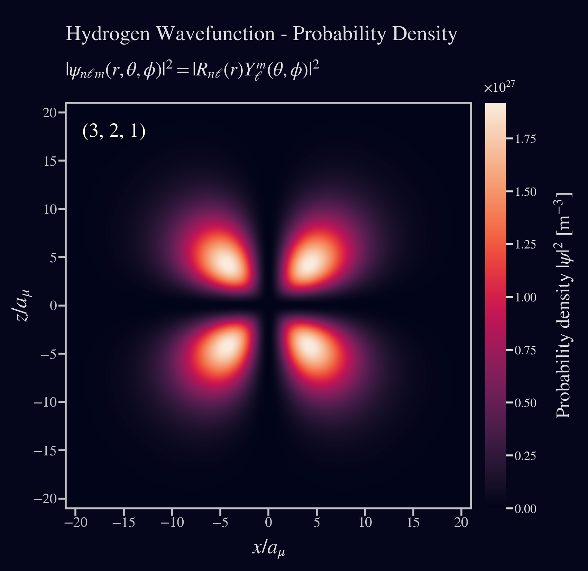
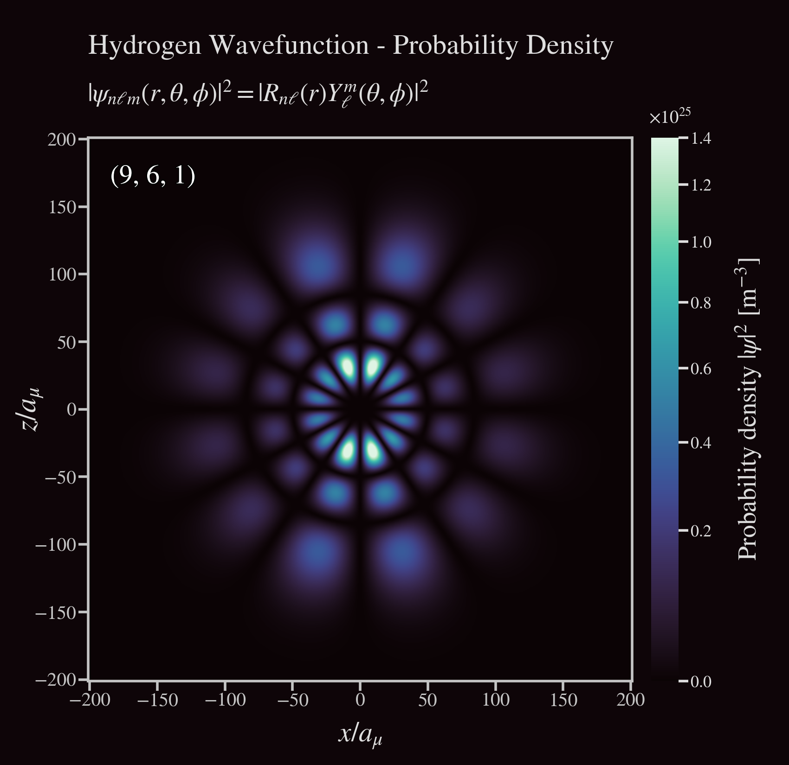

# Hydrogen Wavefunctions & Electron Density Plots

Modeling and visualization of bound-state hydrogen eigenfunctions and electron probability densities.

* Python 3.12.11
* Matplotlib 3.10.6
* Seaborn 0.13.2
* NumPy 2.3.2
* SciPy 1.16.1

### Model computations:
- Normalized radial functions with stable log-gamma normalization & complex spherical harmonics.
- Stationary-state wavefunction on an $x–z$ plane grid $(y=0)$.
- Probability densities and radial probability distributions.
- Reduced-mass Bohr radius and electron–nucleus reduced mass.

---

### Project Files
* [hydrogen_wavefunction.py - Wavefunction computational modeling](hydrogen_wavefunction.py)
* [hwf_plots.py - Plotting module](hwf_plots.py)
* [main.py - Application entry-point to showcase samples](main.py)
* [hydrogen_wavefunctions.ipynb - IPython / Jupyter Notebook](hydrogen_wavefunctions.ipynb)

---

## Content
#### Theoretical Background
* [Quantum Mechanics and Atomic Systems: A Brief Overview](#1-quantum-mechanics-and-atomic-systems-a-brief-overview)
* [Schrödinger Equation for Hydrogen Atom Wavefunctions](#2-schrödinger-equation-for-hydrogen-atom-wavefunctions)
* [Model assumptions](#3-model-assumptions)
* [References](#references)
  
#### Showcase
* [Modeling Examples](#4-modeling-examples)

---

### 1. Quantum Mechanics and Atomic Systems: A Brief Overview

Quantum mechanics (QM) is the fundamental theory in physics that provides a 
description of the physical properties of nature at the scale of atoms and subatomic particles. 
Unlike classical mechanics which describes macroscopic phenomena, QM addresses the behavior 
of matter and energy on the quantum (smallest discrete) level.

The hydrogen atom is especially significant as it is the simplest atom, containing just one electron. 
Its wavefunction can be treated analytically, providing profound insights into the nature of quantum systems.

<br>

<p align='center'>
  
</p>
<p align='center'>
    <i>Electron probability density for hydrogen atom orbitals shown as cross-sections</i>
</p>

---

#### 1.1 Wavefunctions

A wavefunction ($\psi$) represents the quantum state of a particle in a system. 
It provides information about the probability amplitude of stationary position and momentum states. 

#### 1.2 Electron Density | Probability Density

The square magnitude of the wavefunction $|\psi|^2$ gives the probability density for 
the particle's position in space. For an electron in an atom, it describes the spatial distribution 
of the probability of locating the electron.

#### 1.3 Atomic Orbitals

These are mathematical functions that describe the wave-like 
behavior of either one electron or a pair of electrons in an atom. These 
functions can be used to determine the probability of finding an 
electron in any specific region around the atom's nucleus; Their angular structure is carried by spherical harmonics and their radial structure by associated Laguerre polynomials.

<br>

<p align='center'>
    
</p>
<p align='center'>
    <i>Electron density plot showing regions of varying electron probability</i>
</p>

---

#### 1.4 Quantum Numbers

We can describe quantum numbers as a set of numerical values that provide a complete 
description of a quantum particle's state. 
For electrons in an atom, there are typically four quantum numbers:
<br>

- Principal quantum number ($n$): `( 1 <= n )`<br>
Represents the electron's energy level and relative size of the orbital.


- Azimuthal quantum number ($\ell$): `( 0 <= l <= n-1 )`<br>
Relates to the shape of the atomic orbital.


- Magnetic quantum number ($m_\ell$): `( -l <= m <= l )`<br>
Specifies the orientation of the orbital in space.


- Spin quantum number ($m_s$): `( +1/2 or -1/2 )`<br>
Describes the electron's intrinsic spin.

Spin is excluded here (no spin–orbit, hyperfine, or fine‑structure corrections).

<br>

> [!NOTE]
> In the hydrogen atom, or any atom with a single electron (like ionized helium, lithium, etc.), 
the electron's spin doesn't interact with anything else to affect its spatial distribution.
> 
> For our specific application with the hydrogen atom, we will focus on the first three quantum numbers, as the electron's spin doesn't influence the shape or 
distribution of the electron cloud.

---

### 2. Schrödinger Equation for Hydrogen Atom Wavefunctions

The Schrödinger equation serves as the foundation of quantum mechanics,
it is a differential equation that determines the wavefunctions of a quantum system. 
For the hydrogen atom, we use the following representation of the time-independent Schrödinger equation:

$\large \hat{H} \psi = E \psi$

$H$ is the Hamiltonian operator, which represents the total energy (kinetic + potential) of the system, 
and $E$ is the total energy of the system.

Given the spherical symmetry of the hydrogen atom, we may express it in terms of 
spherical coordinates $(r, \theta, \phi)$ instead of rectangular coordinates $(x, y, z)$. 
Where $r$ is the radial coordinate, $\theta$ is the polar angle (relative to the vertical z-axis), 
and $\phi$ is the azimuthal angle (relative to the x-axis).

<p align='center'>
  
</p>
<p align='center'>
    <i>Relationship between the spherical and rectangular coordinate systems</i>
</p>

The wavefunction can be represented as a product of radial and angular functions:

$\large \psi(r, \theta, \phi) = R(r) Y(\theta, \phi)$

When the Hamiltonian is expressed in spherical coordinates, it contains both radial and angular parts.
By substituting this into the Schrödinger equation, we separate the equation into two parts: 
one that depends only on $r$ (the radial part) and another that depends on $\theta$ and $\phi$ (the angular part).

---

#### 2.1 Radial Component

$\large R_{n \ell}(r) = \left(\frac{2Z}{n a_{\mu}}\right)^{\!3/2}
\sqrt{\frac{(n-\ell-1)!}{2n(n+\ell)!}}\;
e^{-\frac{Z r}{n a_{\mu}}}
\left(\frac{2 Z r}{n a_{\mu}}\right)^{\ell}
L_{n-\ell-1}^{\,2\ell+1}\!\left(\frac{2 Z r}{n a_{\mu}}\right)$

The radial wavefunction gives us information about the probability
distribution of the electron as a function of distance $r$ from the 
nucleus. Its form encompasses three major terms:

<br>

**2.1.1 Exponential Decay**

Signifies the probability decay of finding an 
electron as we move away from the nucleus. Here, $a_{\mu}$ is the reduced-mass Bohr 
radius, which sets the characteristic length scale; the decay constant scales with $Z$:

$\large e^{-\frac{Z r}{n a_{\mu}}}$

<br>

**2.1.2 Power term**

Dictates how the probability changes with $r$. 
The azimuthal quantum number $\ell$ governs the near-origin behavior and number of radial nodes:

$\large \left( \frac{2 Z r}{n a_{\mu}} \right)^{\ell}$

<br>

**2.1.3 Associated Laguerre Polynomials**

These polynomials contribute to the finer structure of the radial part, especially defining nodes (regions where the probability is zero):

$\large L_{n-\ell-1}^{\,2\ell+1}\!\left(\frac{2 Z r}{n a_{\mu}}\right)$

---

#### 2.2 Angular Component

$\large Y_{\ell}^{m}(\theta, \phi) = (-1)^m \sqrt{\frac{(2\ell+1)}{4\pi}\frac{(\ell-m)!}{(\ell+m)!}}\, P_{\ell}^{m}(\cos\theta)\, e^{i m \phi}$

The angular wavefunction yields the spherical harmonics, which gives the angular dependence of the wavefunction in terms of the polar ($\theta$) and azimuthal ($\phi$) angles. These spherical harmonics provide a detailed account of the shapes and orientations of atomic orbitals,
characterizing how electron probability distributions are spread out in space. 
It has two components:

<br>

**2.2.1 Associated Legendre Polynomials**

These dictate the shape of the orbital in the polar ($\theta$) direction,
helping to define the characteristic shapes (s, p, d, etc.) we often associate with atomic orbitals:

$\large P_{\ell}^{m}(\cos\theta)$

<br>

**2.2.2 Exponential Azimuthal Term**

This term provides the orientation of the orbital in the azimuthal plane, as 
determined by the magnetic quantum number $m$:

$\large e^{i m \phi}$

---

#### 2.3 Normalized wavefunction

The resultant normalized wavefunction for the hydrogen atom (and hydrogenic ions) is the product of the solutions of the radial and angular components:

$\large \psi_{n \ell m}(r, \theta, \phi) = R_{n \ell}(r)\; Y_{\ell}^{m}(\theta, \phi)$

<br>

To determine the probability density $|\psi_{n \ell m}|^2$ of the electron being in a certain location,
we take the square magnitude of the wavefunction:

$\large P(r, \theta, \phi) = |\psi_{n \ell m}(r, \theta, \phi)|^2$

<br>

In addition, the radial probability distribution describes the probability of finding the electron between $r$ and $r+dr$:

$\large P_{n\ell}(r) = r^2\, |R_{n\ell}(r)|^2$

---

### 3. Model Assumptions

- Non-relativistic, point nucleus, Schrödinger hydrogenic Hamiltonian with Coulomb potential.
- No spin/fine-structure, external fields, or finite-nuclear-size effects.
- Shapes broadcast; $R$ is real-valued, $Y_{\ell}^{m}$ and $\psi$ are complex.
- $R$ and $\psi$ have units of $\,\mathrm{m}^{-3/2}$.
- $Y_{\ell}^{m}$ and $Z$ are dimensionless. 
- Cartesian coordinates $(x,y,z)$ and radial distance $r$ are in meters.
- Masses are in kilograms.

---

#### 3.1 Reduced-mass correction and effective Bohr radius

To account for the finite nuclear mass, the model uses the electron–nucleus reduced mass $\mu$ and the corresponding reduced-mass Bohr radius $a_{\mu}$:

$\large \mu = \frac{m_e M}{m_e + M}, \qquad a_{\mu} = a_0 \frac{m_e}{\mu}$

Here $m_e$ is the electron mass, $M$ is the nuclear mass (for Hydrogen $M \approx m_p$), and $a_0$ is the Bohr radius.

Setting $a_{\mu}\!\to\! a_0$ recovers the infinite–nuclear–mass approximation.

---

#### 3.2 Hydrogenic ions and $Z$-scaling

The same formalism applies for hydrogenic ions with nuclear charge $Z$.

All radial length scales contract by $Z$ and the normalized radial function is given with $Z$ and $a_{\mu}$ explicitly included.  
(When $Z>1$, the nuclear mass $M$ must be specified to evaluate $\mu$ and $a_{\mu}$.)

---

#### 3.3 $x–z$ plane slice used for plotting

For visualization, the model evaluates stationary states on the plane $y=0$:

$\large \psi_{n\ell m}(x,0,z) = R_{n\ell}(r)\, Y_{\ell}^{m}(\theta,\phi), \quad r=\sqrt{x^2+z^2}, \quad \cos\theta=\frac{z}{r}$

The azimuth $\phi$ on the $y=0$ plane is prescribed in two modes:

- **Plane mode** (default): $\phi=0\ \text{for}\ x\ge0,\quad \phi=\pi\ \text{for}\ x<0.$

- **Constant mode**: $\large \phi \equiv \phi_0$ (user-specified constant).

This keeps the angular dependence well defined on the slice while preserving the complex phase of $Y_{\ell}^{m}$.

> [!NOTE]
> We use the complex orthonormal spherical harmonics with the Condon–Shortley phase, so that $\int |Y_{\ell}^{m}|^2\, d\Omega = 1$.

---

### 4. Modeling Examples

The function `plot_hydrogen_wavefunction_xz` from the `hwf_plots` module can be used to generate 2D color-mapped plots of the electron probability density $|\psi|^2$ with the following parameters:

<br>

|  Plot Parameter  |                       Description                       |      Type      |
|:----------------:|:-------------------------------------------------------:|:--------------:|
|       `wf`       |                Wavefunction parameters.                 | `WaveFunction` |
|   `color_map`    |                 Seaborn colormap name.                  |     `str`      |
| `use_dark_theme` |                  Theme rendering mode.                  |     `bool`     |
|       `k`        |      Framing scale factor for extent calculation.       |    `float`     |
|    `exposure`    | Exposure correction factor for low-probability regions. |    `float`     |

<br>

---

Below there are some example plots generated for various quantum states of the hydrogen atom:

#### $\large n=3, \ell=2, m=1, Z=1$

```python
wf = WaveFunction(n=3, l=2, m=1)
plot_hydrogen_wavefunction_xz(wf, colormap="rocket", k=2)
```

<p align='left'>
  
</p>

```python
plot_hydrogen_wavefunction_xz(wf, colormap="rocket", use_dark_theme=True, k=2)
```

<p align='left'>
  
</p>

---

#### $\large n=4, \ell=3, m=0, Z=1$

```python
wf = WaveFunction(n=4, l=3, m=0)
plot_hydrogen_wavefunction_xz(wf, colormap="rocket", k=2.2, exposure=0.5)
```

<p align='left'>
  
</p>

```python
plot_hydrogen_wavefunction_xz(wf, colormap="rocket", use_dark_theme=True, k=2.2, exposure=0.5)
```

<p align='left'>
  
</p>

---

#### $\large n=3, \ell=0, m=0, Z=1$

```python
wf = WaveFunction(n=3, l=0, m=0)
plot_hydrogen_wavefunction_xz(wf, colormap="rocket", k=2.5, exposure=1)
```

<p align='left'>
  
</p>

```python
plot_hydrogen_wavefunction_xz(wf, colormap="rocket", use_dark_theme=True, k=2.5, exposure=1)
```

<p align='left'>
  
</p>


---

#### $\large n=4, \ell=3, m=1, Z=1$

```python
wf = WaveFunction(n=4, l=3, m=1)
plot_hydrogen_wavefunction_xz(wf, colormap="rocket", k=2)
```

<p align='left'>
  
</p>

```python
plot_hydrogen_wavefunction_xz(wf, colormap="rocket", use_dark_theme=True, k=2)
```

<p align='left'>
  
</p>

As we examine the electron density plots corresponding to the quantum numbers above, 
we notice that with increasing principal quantum number $n$, 
the complexity of the wavefunction grows. Specifically:

- The number of nodes (regions where the probability density is zero) increases.
- The electron's spatial distribution expands, covering larger regions around the nucleus. 
- The overall shape of the atomic orbital becomes more intricate and detailed.

---

#### $\large n=9, \ell=6, m=1, Z=1$

```python
wf = WaveFunction(n=9, l=6, m=1)
plot_hydrogen_wavefunction_xz(wf, colormap="mako", k=2, exposure=0.5)
```

<p align='left'>
  
</p>

```python
plot_hydrogen_wavefunction_xz(wf, colormap="mako", use_dark_theme=True, k=2, exposure=0.5)
```

<p align='left'>
  
</p>

---

#### $\large n=32, \ell=16, m=1, Z=1$

```python
wf = WaveFunction(n=32, l=16, m=1)
plot_hydrogen_wavefunction_xz(wf, colormap="magma", k=1.8, exposure=0.5)
```

<p align='left'>
  
</p>

```python
plot_hydrogen_wavefunction_xz(wf, colormap="magma", use_dark_theme=True, k=1.8, exposure=0.5)
```

<p align='left'>
  
</p>

For extremely high quantum numbers, the following effects can be observed:

- The complexity increases even further, resulting in numerous nodes and intricate patterns.
- Evaluating the wavefunction over a vast spatial domain becomes computationally intensive.
- Visualization can become cluttered, making it harder to discern specific details or features.

---

### References

 - Griffiths, D.J. (2016) Introduction to quantum mechanics. 3rd edn. Harlow: Pearson. 
 - Atkins, P. and Friedman, R. (2011) Molecular quantum mechanics. 5th edn. Oxford: Oxford University Press. 
 - Bransden, B.H. and Joachain, C.J. (2003) Quantum mechanics. 2nd edn. Harlow: Pearson Education. 
 - Zettili, N. (2009) Quantum mechanics: concepts and applications. 2nd edn. Chichester: Wiley. 
 - Eisberg, R. and Resnick, R. (1985) Quantum physics of atoms, molecules, solids, nuclei, and particles. 2nd edn. New York: Wiley.
- Bethe, H.A. & Salpeter, E.E. (1957) Quantum Mechanics of One- and Two-Electron Atoms. Berlin: Springer.
- Landau, L.D. & Lifshitz, E.M. (1977) Quantum Mechanics: Non-Relativistic Theory. 3rd edn. Oxford: Pergamon.
- Edmonds, A.R. (1960) Angular Momentum in Quantum Mechanics. 2nd edn. Princeton, NJ: Princeton University Press.
 - Freie Universität Berlin (2015) Theoretical chemistry, Available at: https://www.bcp.fu-berlin.de/en/chemie/chemie/forschung/PhysTheoChem/agkeller/_Docs/TC_WS15_Ex07.pdf

---

### Acknowledgements

As of August 2025, the contents of this work have been utilized by various universities, academic institutions, research projects and scientific exhibitions.

Their use in these contexts is gratefully acknowledged, and it continues to be openly available for academic, research, and educational purposes.

Readers, scholars, researchers and institutions are welcome to reference or incorporate it in their own work as appropriate.  

> [!IMPORTANT]  
> This work is openly available for academic, research and educational purposes.<br>
> Voluntary contributions to support this effort are welcome.

[](https://ko-fi.com/G2G31KWRWG)

---
